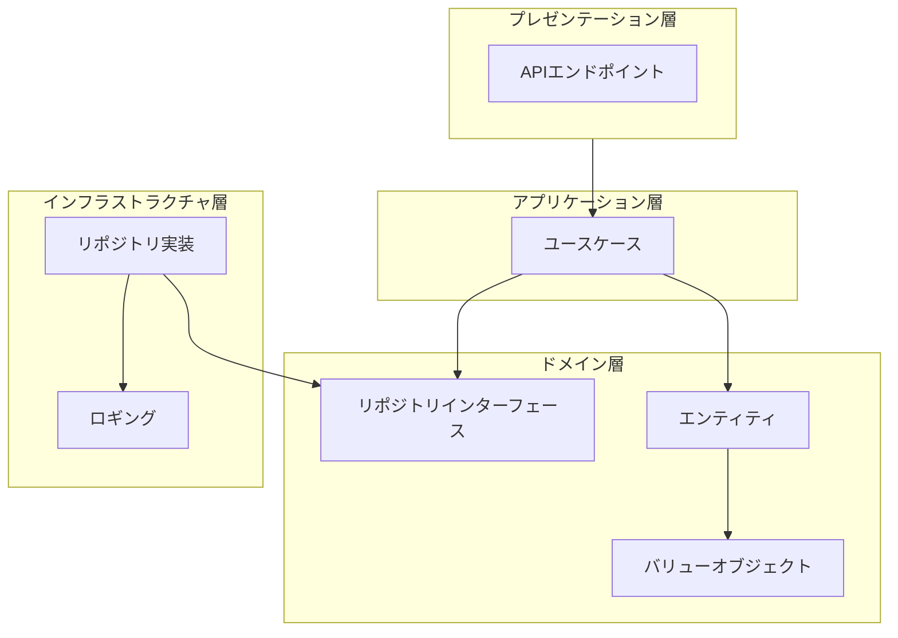

# アーキテクチャーガイド

このドキュメントでは、本プロジェクトで採用しているアーキテクチャーパターンと設計原則について説明します。

## 目次

- [1. 概要](#1-概要)
- [2. オニオンアーキテクチャー](#2-オニオンアーキテクチャー)
- [3. ドメイン駆動設計（DDD）](#3-ドメイン駆動設計ddd)
- [4. レイヤー構成](#4-レイヤー構成)
- [5. 設計原則](#5-設計原則)
- [6. ディレクトリ構造](#6-ディレクトリ構造)

## 1. 概要

本プロジェクトは、**ドメイン駆動設計（Domain-Driven Design: DDD）** の原則に基づき、**オニオンアーキテクチャー（Onion Architecture）** で構築されています。

これらのアーキテクチャーパターンを採用することで、以下のメリットを得ています：

- **ビジネスロジックの独立性**: ドメインロジックが外部の技術的詳細から独立
- **テスタビリティ**: ドメインロジックを外部依存なしでテスト可能
- **保守性**: 変更の影響範囲が明確で、修正が容易
- **拡張性**: 新機能の追加や技術スタックの変更が容易

## 2. オニオンアーキテクチャー

オニオンアーキテクチャーは、ドメインロジックを中心に配置し、外側のレイヤーが内側のレイヤーに依存する構造です。依存関係の方向が一方向に統一されるため、ドメインロジックが外部の技術的な詳細から独立します。

### 2.1 レイヤー構造



注: プレゼンテーション層とアプリケーション層は将来実装予定です。

### 2.2 依存関係の方向

オニオンアーキテクチャーの核心は、**依存関係の方向を一方向に統一する**ことです：

- **外側のレイヤー → 内側のレイヤー**: 外側のレイヤーは内側のレイヤーに依存する
- **内側のレイヤー → 外側のレイヤー**: 依存しない（インターフェースを通じてのみ参照）

この原則により、ドメインロジックは以下の外部要素から独立します：

- データベースの種類（PostgreSQL、MySQL、MongoDBなど）
- Webフレームワーク（Hono、Express、Fastifyなど）
- 外部サービスの実装詳細

## 3. ドメイン駆動設計（DDD）

ドメイン駆動設計は、ソフトウェアの設計においてビジネスロジックを中心に据える設計手法です。本プロジェクトでは、以下のDDDの主要概念を実装しています。

### 3.1 エンティティ（Entity）

エンティティは、一意な識別子（ID）を持つドメインオブジェクトです。識別子によって等価性が判断されます。

**特徴**:
- 一意な識別子を持つ
- ライフサイクルを持つ（作成、更新、削除）
- 識別子で等価性を判断

**実装例**:
- `User`: ユーザーエンティティ
- `Todo`: Todoエンティティ

### 3.2 バリューオブジェクト（Value Object）

バリューオブジェクトは、値そのものによって識別される不変オブジェクトです。エンティティとは異なり、識別子を持ちません。

**特徴**:
- 不変（immutable）
- 値で等価性を判断
- バリデーションロジックを含む

**実装例**:
- `Email`: メールアドレス（形式検証を含む）
- `Username`: ユーザー名（文字数・形式検証を含む）
- `TodoTitle`: Todoタイトル（文字数制限を含む）
- `UserId`, `TodoId`: ID値オブジェクト（UUID形式検証を含む）

### 3.3 リポジトリ（Repository）

リポジトリは、エンティティの永続化を抽象化するパターンです。ドメイン層ではインターフェースのみを定義し、実装はインフラストラクチャ層で行います。

**特徴**:
- ドメイン層からはインターフェースのみを参照
- 永続化の詳細を隠蔽
- ドメインオブジェクトの集合を扱う

**実装例**:
- `IUserRepository`: ユーザーリポジトリインターフェース
- `ITodoRepository`: Todoリポジトリインターフェース

### 3.4 不変性（Immutability）

本プロジェクトでは、エンティティとバリューオブジェクトを不変として設計しています。変更操作は新しいインスタンスを返します。

**メリット**:
- 予期しない副作用の防止
- スレッドセーフ
- デバッグの容易さ
- 状態変更の追跡が容易

## 4. レイヤー構成

### 4.1 ドメイン層（Domain Layer）

ドメイン層は、ビジネスロジックの中核を担うレイヤーです。技術的な詳細を含まず、純粋なビジネスルールのみを実装します。

**構成要素**:
- **エンティティ**: ビジネスオブジェクト
- **バリューオブジェクト**: 値オブジェクト
- **リポジトリインターフェース**: 永続化の抽象化
- **ドメインサービス**: 複数のエンティティにまたがるロジック（将来実装予定）

**ディレクトリ構造**:
```
src/domain/
├── user/              # ユーザー集約
│   ├── entity.ts      # Userエンティティ
│   ├── repository.ts  # IUserRepositoryインターフェース
│   └── vo/           # バリューオブジェクト
│       ├── id.ts     # UserId
│       ├── email.ts  # Email
│       └── username.ts # Username
├── todo/              # Todo集約
│   ├── entity.ts      # Todoエンティティ
│   ├── repository.ts  # ITodoRepositoryインターフェース
│   └── vo/           # バリューオブジェクト
│       ├── id.ts     # TodoId
│       ├── title.ts  # TodoTitle
│       ├── body.ts   # TodoBody
│       └── status.ts # TodoStatus
└── shared/            # 共有ドメイン
    └── vo/
        └── id.ts     # BaseId（基底クラス）
```

### 4.2 アプリケーション層（Application Layer）

アプリケーション層は、ユースケースを実装するレイヤーです（将来実装予定）。

**責務**:
- ユースケースの実装
- トランザクション管理
- ドメインサービスとの連携
- ドメインオブジェクトの組み合わせ

**特徴**:
- ビジネスロジックは含まない（ドメイン層に委譲）
- アプリケーション固有のワークフローを実装
- 複数のドメインオブジェクトを協調させる

### 4.3 インフラストラクチャ層（Infrastructure Layer）

インフラストラクチャ層は、技術的な実装の詳細を担当するレイヤーです。

**責務**:
- リポジトリの実装（データベースアクセスなど）
- 外部サービスとの連携
- ロギング
- ファイルI/O

**特徴**:
- ドメイン層のインターフェースを実装
- 技術的な詳細を隠蔽
- 変更・交換が容易

**ディレクトリ構造**:
```
src/infrastructure/
├── repository/        # リポジトリ実装（将来実装予定）
│   ├── user.repository.ts
│   └── todo.repository.ts
└── logging/          # ロギング実装
```

### 4.4 プレゼンテーション層（Presentation Layer）

プレゼンテーション層は、外部とのインターフェースを提供するレイヤーです（将来実装予定）。

**責務**:
- REST APIエンドポイント
- リクエスト/レスポンスの変換
- 認証・認可
- バリデーション（入力値の検証）

**特徴**:
- アプリケーション層のユースケースを呼び出す
- HTTPリクエスト/レスポンスの変換
- エラーハンドリング

## 5. 設計原則

### 5.1 依存性逆転の原則（Dependency Inversion Principle）

ドメイン層は、具体的な実装ではなく、抽象（インターフェース）に依存します。これにより、ドメインロジックが技術的な詳細から独立します。

**例**:
- ドメイン層: `IUserRepository`インターフェースを定義
- インフラストラクチャ層: `IUserRepository`を実装（Prisma、TypeORMなど）

### 5.2 単一責任の原則（Single Responsibility Principle）

各クラス・モジュールは、単一の責任のみを持ちます。

**例**:
- `Email`: メールアドレスの検証と正規化のみを担当
- `User`: ユーザーエンティティの振る舞いのみを担当
- `IUserRepository`: ユーザーの永続化のみを担当

### 5.3 不変性（Immutability）

エンティティとバリューオブジェクトは不変として設計されています。変更操作は新しいインスタンスを返します。

**例**:
```typescript
// 不変性の実装例
const updatedUser = user.changeEmail(newEmail);
// userは変更されず、updatedUserが新しいインスタンスとして返される
```

### 5.4 豊富なドメインモデル（Rich Domain Model）

ビジネスロジックは、ドメインオブジェクト（エンティティ・バリューオブジェクト）に集約されます。アナミックなドメインモデル（ビジネスロジックがサービス層に散在するモデル）を避けます。

**例**:
- ✅ `user.changeEmail(newEmail)` - ドメインオブジェクトにメソッドが存在
- ❌ `userService.changeEmail(user, newEmail)` - サービス層にロジックが存在

## 6. ディレクトリ構造

プロジェクトのディレクトリ構造は、アーキテクチャーのレイヤーに基づいて組織化されています。

```
src/
├── domain/                    # ドメイン層
│   ├── user/                  # ユーザー集約
│   │   ├── entity.ts          # Userエンティティ
│   │   ├── repository.ts      # IUserRepositoryインターフェース
│   │   └── vo/                # バリューオブジェクト
│   ├── todo/                  # Todo集約
│   │   ├── entity.ts          # Todoエンティティ
│   │   ├── repository.ts      # ITodoRepositoryインターフェース
│   │   └── vo/                # バリューオブジェクト
│   └── shared/                # 共有ドメイン
│       └── vo/                # 共有バリューオブジェクト
├── application/               # アプリケーション層（将来実装予定）
│   └── usecase/
├── infrastructure/            # インフラストラクチャ層（将来実装予定）
│   ├── repository/            # リポジトリ実装
│   └── logging/               # ロギング実装
├── presentation/              # プレゼンテーション層（将来実装予定）
│   └── api/                   # APIエンドポイント
└── index.ts                   # エントリーポイント
```

### 6.1 集約（Aggregate）

ドメイン層は、**集約（Aggregate）** ごとにディレクトリを分けています。集約は、関連するエンティティとバリューオブジェクトをグループ化するDDDの概念です。

**現在の集約**:
- `user`: ユーザー集約
- `todo`: Todo集約
- `shared`: 共有ドメイン要素

### 6.2 ファイル命名規則

- **エンティティ**: `entity.ts`
- **リポジトリインターフェース**: `repository.ts`
- **バリューオブジェクト**: `vo/`ディレクトリ内に配置

---

**参考資料**:
- [Domain-Driven Design](https://martinfowler.com/bliki/DomainDrivenDesign.html) - Martin Fowler
- [Onion Architecture](https://jeffreypalermo.com/2008/07/the-onion-architecture-part-1/) - Jeffrey Palermo
- [Implementing Domain-Driven Design](https://www.domainlanguage.com/ddd/) - Eric Evans
