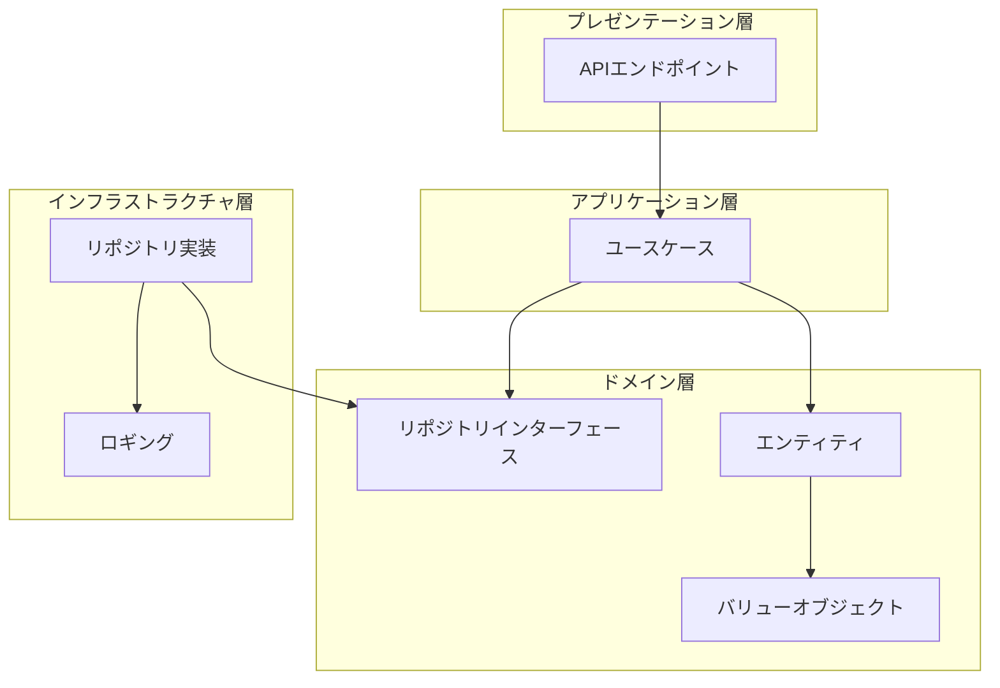

# システム仕様書

## 目次

- [1. 概要](#1-概要)
  - [1.1 目的](#11-目的)
  - [1.2 システム範囲](#12-システム範囲)
  - [1.3 背景](#13-背景)
- [2. システム構成](#2-システム構成)
  - [2.1 アーキテクチャー概要](#21-アーキテクチャー概要)
  - [2.2 レイヤー構造](#22-レイヤー構造)
  - [2.3 依存関係の方向](#23-依存関係の方向)
- [3. 機能要件](#3-機能要件)
  - [3.1 ユーザー管理機能](#31-ユーザー管理機能)
  - [3.2 Todo管理機能](#32-todo管理機能)
- [4. 非機能要件](#4-非機能要件)
  - [4.1 パフォーマンス](#41-パフォーマンス)
  - [4.2 セキュリティ](#42-セキュリティ)
  - [4.3 可用性](#43-可用性)
  - [4.4 保守性](#44-保守性)
  - [4.5 拡張性](#45-拡張性)
- [5. 制約事項](#5-制約事項)

## 1. 概要

### 1.1 目的

本システムは、オニオンアーキテクチャー（Onion Architecture）とドメイン駆動設計（Domain-Driven Design: DDD）の原則に基づいて構築された、Todo管理を提供するWebアプリケーションです。

主な目的は以下の通りです：

- クリーンアーキテクチャーの実践による保守性の高いコードベースの構築
- ドメインロジックの独立性確保
- 型安全性による実行時エラーの削減
- テスタビリティの向上

### 1.2 システム範囲

本システムは以下の機能を提供します：

- **ユーザー管理**: ユーザーの作成、情報更新、削除
- **Todo管理**: Todoアイテムの作成、更新、削除、ステータス管理

現在の実装では、ドメインレイヤーとインフラストラクチャレイヤーの基盤が整備されており、アプリケーションレイヤーとプレゼンテーションレイヤーの実装は今後の拡張として予定されています。

### 1.3 背景

本システムは、TypeScriptとHonoフレームワークを使用したオニオンアーキテクチャーの実装例として開発されています。Bunランタイムを活用することで、高速な開発体験と実行パフォーマンスを実現しています。

## 2. システム構成

### 2.1 アーキテクチャー概要

本システムは**オニオンアーキテクチャー**（Onion Architecture）を採用しています。オニオンアーキテクチャーは、ドメインロジックを中心に配置し、外側のレイヤーが内側のレイヤーに依存する構造です。

注: プレゼンテーション層とアプリケーション層は将来実装予定です。

### 2.2 レイヤー構造

#### ドメイン層（Domain Layer）

ドメイン層は、ビジネスロジックの中核を担うレイヤーです。以下の要素で構成されています：

- **エンティティ（Entity）**: 一意な識別子を持つドメインオブジェクト
  - `User`: ユーザーエンティティ
  - `Todo`: Todoエンティティ
- **バリューオブジェクト（Value Object）**: 値そのものによって識別される不変オブジェクト
  - `UserId`, `TodoId`: ID値オブジェクト
  - `Email`, `Username`: ユーザー関連の値オブジェクト
  - `TodoTitle`, `TodoBody`, `TodoStatus`: Todo関連の値オブジェクト
- **リポジトリインターフェース（Repository Interface）**: 永続化の抽象化
  - `IUserRepository`: ユーザーリポジトリのインターフェース
  - `ITodoRepository`: Todoリポジトリのインターフェース

#### インフラストラクチャ層（Infrastructure Layer）

インフラストラクチャ層は、技術的な実装の詳細を担当するレイヤーです：

- **リポジトリ実装**: データベースや外部ストレージへのアクセス実装（将来実装予定）
- **ロギング**: ログ出力機能

#### アプリケーション層（Application Layer）

アプリケーション層は、ユースケースを実装するレイヤーです（将来実装予定）：

- ユースケースの実装
- トランザクション管理
- ドメインサービスとの連携

#### プレゼンテーション層（Presentation Layer）

プレゼンテーション層は、外部とのインターフェースを提供するレイヤーです（将来実装予定）：

- REST APIエンドポイント
- リクエスト/レスポンスの変換
- 認証・認可

### 2.3 依存関係の方向

オニオンアーキテクチャーの原則に従い、依存関係は以下の方向に統一されています：

- **外側のレイヤー → 内側のレイヤー**: 外側のレイヤーは内側のレイヤーに依存する
- **内側のレイヤー → 外側のレイヤー**: 依存しない（インターフェースを通じてのみ参照）

この原則により、ドメインロジックは外部の技術的な詳細から独立しており、テスタビリティと保守性が向上します。

## 3. 機能要件

### 3.1 ユーザー管理機能

#### 3.1.1 ユーザー作成

**機能概要**: 新しいユーザーを作成します。

**入力**:
- メールアドレス（Email）
- ユーザー名（Username）

**処理**:
1. メールアドレスとユーザー名のバリデーションを実行
2. ユーザーID（UUID v7）を自動生成
3. 作成日時と更新日時を現在時刻に設定
4. Userエンティティを生成

**出力**:
- 作成されたUserエンティティ

**エラー条件**:
- メールアドレスの形式が不正
- ユーザー名がバリデーションルールに違反

#### 3.1.2 ユーザー情報更新

**機能概要**: 既存ユーザーの情報を更新します。

**3.1.2.1 メールアドレス変更**

**入力**:
- ユーザーID
- 新しいメールアドレス

**処理**:
1. ユーザーIDでユーザーを検索
2. 新しいメールアドレスのバリデーションを実行
3. 更新日時を現在時刻に更新
4. 新しいUserエンティティを生成（不変性の原則）

**出力**:
- 更新されたUserエンティティ

**3.1.2.2 ユーザー名変更**

**入力**:
- ユーザーID
- 新しいユーザー名

**処理**:
1. ユーザーIDでユーザーを検索
2. 新しいユーザー名のバリデーションを実行
3. 更新日時を現在時刻に更新
4. 新しいUserエンティティを生成（不変性の原則）

**出力**:
- 更新されたUserエンティティ

#### 3.1.3 ユーザー削除

**機能概要**: 既存ユーザーを削除します。

**入力**:
- ユーザーID

**処理**:
1. ユーザーIDでユーザーを検索
2. ユーザーを削除

**出力**:
- なし

**エラー条件**:
- 指定されたユーザーIDが存在しない

#### 3.1.4 ユーザー検索

**機能概要**: IDを指定してユーザーを検索します。

**入力**:
- ユーザーID

**処理**:
1. ユーザーIDでユーザーを検索

**出力**:
- 見つかったUserエンティティ、またはnull（存在しない場合）

### 3.2 Todo管理機能

#### 3.2.1 Todo作成

**機能概要**: 新しいTodoアイテムを作成します。

**入力**:
- ユーザーID（UserId）
- タイトル（TodoTitle）
- 本文（TodoBody、オプション）

**処理**:
1. ユーザーID、タイトルのバリデーションを実行
2. 本文が指定されていない場合は空文字列を設定
3. TodoID（UUID v7）を自動生成
4. ステータスを`NOT_STARTED`に設定
5. 作成日時と更新日時を現在時刻に設定
6. Todoエンティティを生成

**出力**:
- 作成されたTodoエンティティ

**エラー条件**:
- タイトルがバリデーションルールに違反
- 本文がバリデーションルールに違反

#### 3.2.2 Todo更新

**機能概要**: 既存Todoアイテムの情報を更新します。

**3.2.2.1 タイトル変更**

**入力**:
- TodoID
- 新しいタイトル

**処理**:
1. TodoIDでTodoを検索
2. 新しいタイトルのバリデーションを実行
3. 更新日時を現在時刻に更新
4. 新しいTodoエンティティを生成（不変性の原則）

**出力**:
- 更新されたTodoエンティティ

**3.2.2.2 本文変更**

**入力**:
- TodoID
- 新しい本文

**処理**:
1. TodoIDでTodoを検索
2. 新しい本文のバリデーションを実行
3. 更新日時を現在時刻に更新
4. 新しいTodoエンティティを生成（不変性の原則）

**出力**:
- 更新されたTodoエンティティ

**3.2.2.3 ステータス変更**

**機能概要**: Todoのステータスを変更します。

**入力**:
- TodoID
- 新しいステータス（NOT_STARTED, IN_PROGRESS, PENDING, COMPLETED）

**処理**:
1. TodoIDでTodoを検索
2. ステータスの有効性を確認
3. 更新日時を現在時刻に更新
4. 新しいTodoエンティティを生成（不変性の原則）

**出力**:
- 更新されたTodoエンティティ

**エラー条件**:
- 指定されたTodoIDが存在しない
- 無効なステータス値

#### 3.2.3 Todo削除

**機能概要**: 既存Todoアイテムを削除します。

**入力**:
- TodoID

**処理**:
1. TodoIDでTodoを検索
2. Todoを削除

**出力**:
- なし

**エラー条件**:
- 指定されたTodoIDが存在しない

#### 3.2.4 Todo検索

**機能概要**: IDを指定してTodoを検索します。

**入力**:
- TodoID

**処理**:
1. TodoIDでTodoを検索

**出力**:
- 見つかったTodoエンティティ、またはnull（存在しない場合）

## 4. 非機能要件

### 4.1 パフォーマンス

- **レスポンスタイム**: APIエンドポイントの応答時間は100ms以下を目標とする（将来実装時）
- **スループット**: 同時リクエスト処理能力を考慮した設計
- **ID生成**: UUID v7を使用することで、時系列順のソートが可能で、データベースのインデックス効率を向上

### 4.2 セキュリティ

- **入力検証**: すべての入力値はValue Objectレベルで厳密にバリデーション
- **型安全性**: TypeScriptによるコンパイル時型チェック
- **不変性**: エンティティとValue Objectは不変（immutable）として設計され、意図しない変更を防止
- **認証・認可**: 将来実装予定（現在は未実装）

### 4.3 可用性

- **エラーハンドリング**: 適切なエラーメッセージと例外処理
- **ロギング**: インフラストラクチャ層でのログ出力機能（将来拡張予定）
- **データ整合性**: トランザクション管理による整合性保証（将来実装予定）

### 4.4 保守性

- **コード品質**: Biomeによる自動フォーマットとリント
- **型チェック**: TypeScriptによる厳密な型チェック
- **テスト**: Vitestによるユニットテスト
- **ドキュメント**: コード内のJSDocコメントと本仕様書

### 4.5 拡張性

- **アーキテクチャー**: オニオンアーキテクチャーによる柔軟な拡張性
- **インターフェース**: リポジトリパターンによる実装の交換可能性
- **ドメインモデル**: 新機能追加時の影響範囲を最小化

## 5. 制約事項

### 5.1 技術的制約

- **ランタイム**: Bun v1.0以降が必要
- **Node.js互換性**: Bunランタイムに依存するため、Node.jsでは実行不可
- **データベース**: 現在はリポジトリインターフェースのみ定義されており、実装は将来予定

### 5.2 機能制約

- **認証・認可**: 現在は未実装（将来実装予定）
- **APIエンドポイント**: 現在は基本的なHello Worldのみ（将来実装予定）
- **データ永続化**: リポジトリの実装は未実装（将来実装予定）
- **トランザクション管理**: 未実装（将来実装予定）

### 5.3 バリデーション制約

- **メールアドレス**: RFC 5321に準拠した基本的な検証のみ（完全なRFC準拠ではない）
- **ユーザー名**: 日本語などのマルチバイト文字は未対応
- **Todo本文**: 改行文字や特殊文字の処理は実装依存

### 5.4 パフォーマンス制約

- **同時実行**: 現在の実装では同時実行性の考慮は限定的
- **データベース**: データベース実装時のパフォーマンスは実装依存

---

**最終更新日**: 2024年（実装日時による）  
**バージョン**: 1.0.0
